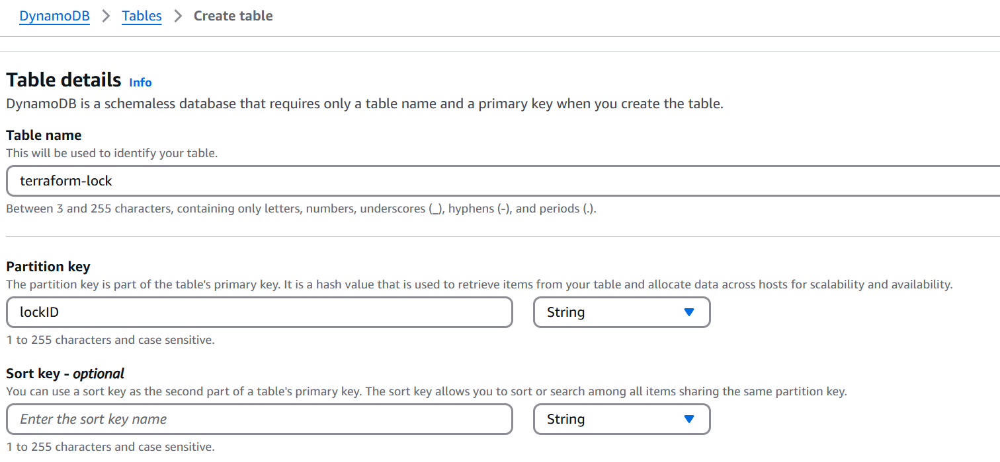

Terraform Backend
Terraform Module

Terraform Backend---

Create S3 bucket 

Update the terraform config with Bakend details

to enable the state locking we need to create a dynamo db

search dynamo db in aws

create a dynamo db 

Terraform Module ----
