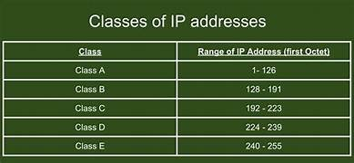
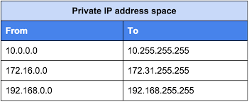

# Networking IP Address and Subnetting

# IP --- Internet Protocol 

IPV4, IPV6

IPV4 -- 32bit binary number 10.0.0.1  + Subnet 255.255.255.0

IPV6 - 128 bit hexadecimal 1234:2133:1212:AC12::1210:2342:ABC:123

 128  64  32  16 8  4  2  1 
 0    0    0   0  1  0  1  0
 1    1    0   0  0  0  0  0
 1     0   1   0   1 0  0  0 
 1    1    1   1   1 1  1  1
10.0.0.1 -- 00001010.00000000.00000000.00000001
192.168.1.20  ---11000000.10101000.00000001.00010100

192.168.1.5 255.255.255.0

Classes ---

A  -- 1-126 - 255.0.0.0        10.0.0.0 -- 10.255.255.255
B  ---128-191 - 255.255.0.0    172.16.0.0 -- 172.32.255.255
C-----192-223 - 255.255.255.0  192.168.0.0 -- 192.168.255.255
D ----224 - 239 255.255.255.255
E ----240-255

Subneting 

10.0.0.5 255.0.0.0

Network bit ---- Host bit

192.168.1.0/24    0, 1-255  First last last IPs can not be used ?

192.168.1.255 <---

brodcast and multicast

192.168.1.0 255.255.0.0

192.168.0.0/16  VNET

192.168.1.0/24  Prod 
192.168.2.0/24  Dev
192.168.3.0/24  --Kubet
192.168.4.0/24  VM

----------------------------------------------------

192.168.1.0/24    VNET

 128  64  32  16 8  4  2  1 
  10000000
 256/4 =64

 11111111.11111111.1111111.10000000

 255.255.255.128   =  /25 urther subnetting into 2

 192.168.1.1-127/25   Subnet 1
 192.168.128-255/25   Subnet 2

 11111111.11111111.11111111.11000000

 Subnet 255.255.255.192   =  /26 further subnetting into 4

 192.168.1.1-63/26
 192.168.1.64-127/26
 192.168.1.128-191/26
 192.168.1.192-255/26